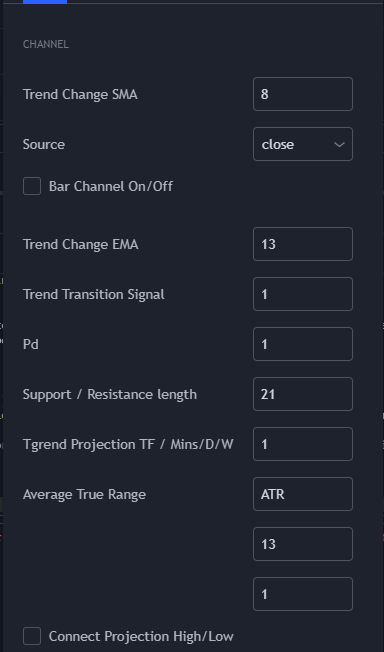
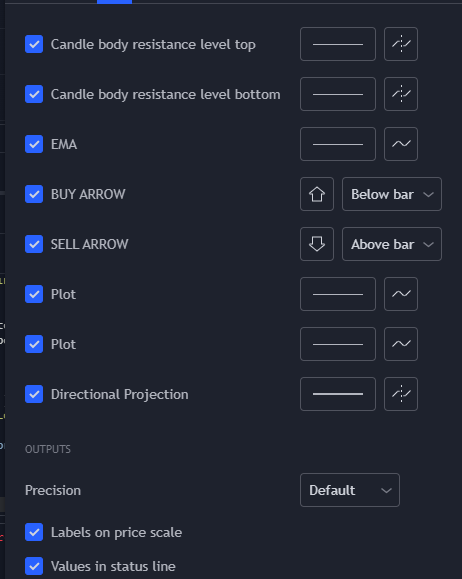
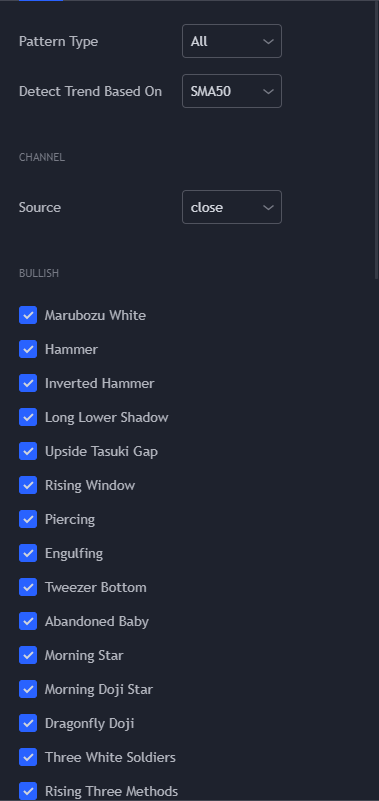
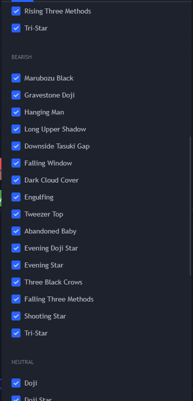
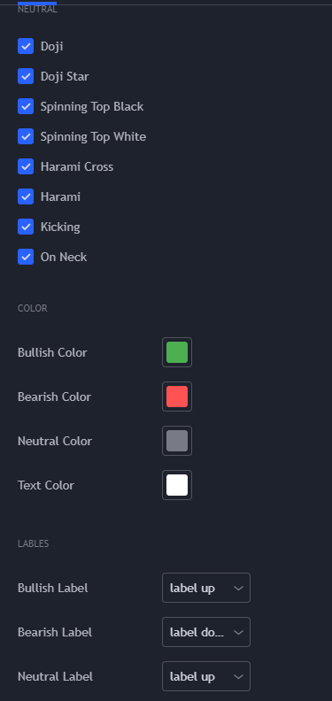
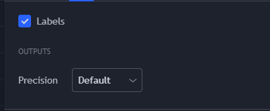
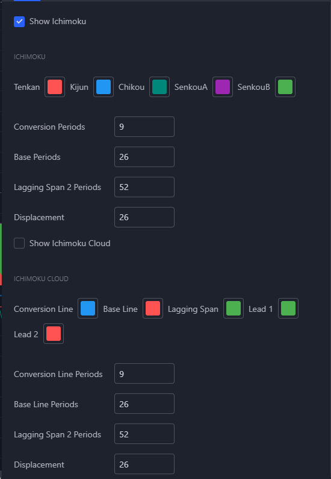
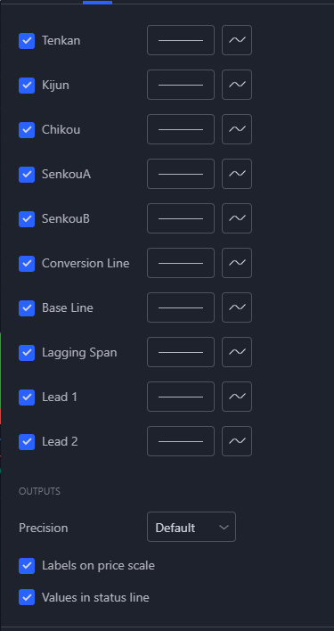
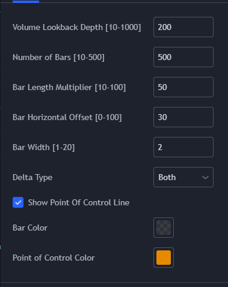
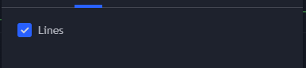

###### [Home](https://github.com/RyKaj/PineScript/blob/master/README.md) |  |
------------

  

# TradingView Scripts

  

Created custom scripts to have more options or have multiple indicator applied at once

  

## Table of Content

- [Buy Sell Labels](#bsl)

- [CandleStick Patterns](#csp)

- [Ichimou & Cloud](#ic)

- [Moving Average](#ma)

- [Support & Resistance](#sr)

- [Volume Profile](#vp)

  
<a  name="bsl"  />

### Buy Sell Labels
- Ability to Change ranges
- Ability to configure colour schematics
- Ability to configure style 
<kbd></kbd> 
<kbd></kbd> 
  
<a  name="csp"  />

### Candlestick Patterns
- Ability to change filter on trend patterns.
- Toggle the differnet patterns
- Ability to Change ranges
- Ability to configure colour schematics
<kbd></kbd> 
<kbd></kbd> 
<kbd></kbd> 
<kbd></kbd> 
  

<a  name="ic"  />

### Ichimou & Cloud
- Ability to toggle Ichimou and Ichimou Cloud
- Ability to configure colour schematics
- Ability to configure indicators
- Ability to configure style 
<kbd></kbd> 
<kbd></kbd> 

<a  name="ma"  />

### Moving Average
- Ability to toggle different SMA & EMA length and Trend, Golden Cross, Death Cross. 
- Ability to configure colour schematics  
<kbd></kbd> 
<kbd></kbd> 
<kbd></kbd> 
  

<a  name="sr"  />

### Support & Resistance
- Ability to toggle different Support, Resistance, Directional Projection & Trend. 
- Ability to configure colour schematics. 
<kbd></kbd> 
<kbd></kbd> 

<a  name="vp"  />

### Volume Profile
- Ability to configure colour schematics and other properties. 
<kbd></kbd> 
<kbd></kbd> 
